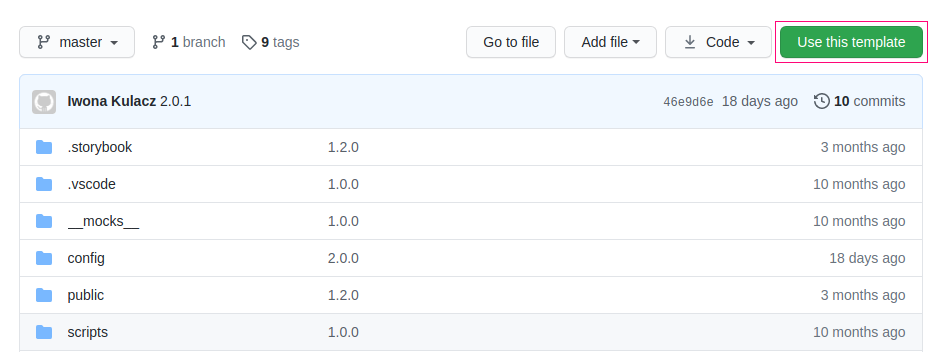
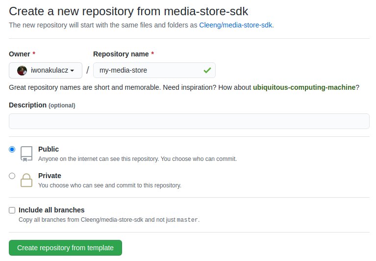

# Installation

MediaStore SDK repo is marked as a template so you can easily move it directly to your GitHub account. Just use `Use this template` option.

<div style="display: flex; align-items: center; flex-direction: column">
  
  
</div>

Upon creating the repository, please proceed with the below steps

1. Clone repo to your pc (use the link from your GitHub if you used a template)

`git clone https://github.com/Cleeng/media-store-sdk`

2. Go to the repo (name can be changed if you use a template)

`cd media-store-sdk`

3. Install packages with yarn

`yarn install`

4. Create a script `development.js` in `config/environments` containing setups for the development environment.

Here is an example of a file to connect to the sandbox. You can use it for your development.

```
module.exports = {
  ENVIRONMENT_CONFIGURATION: {
    API_URL: JSON.stringify('https://mediastore-sandbox.cleeng.com'),
    ADYEN_CLIENT_KEY: JSON.stringify('test_I4OFGUUCEVB5TI222AS3N2Y2LY6PJM3K'), //write to BSS team to add your origin to the whitelist
  }
};
```

All the configs defined in `config/environments` can be accessed in code via a global ENVIRONMENT_CONFIGURATION constant.

To select a specific environment for a run or build, use the `--environment` flag, e.g. `yarn start --environment=production`.

Scripts containing setups are in `js` format.

<table>
<tr>
    <th>Configuration</th>
    <th>Description</th>
</tr>
<tr><td>API_URL</td><td>identifies the host of REST API</td></tr>
<tr><td>ADYEN_CLIENT_KEY</td>
  <td>
    identifies Adyen's Client Key. It’s a Cleeng key, which allows you to use Adyen enpoint (when Cleeng is MoR). To use it we need to add your origin to allowed ones. Values:
    testing `test_I4OFGUUCEVB5TI222AS3N2Y2LY6PJM3K`,
    production `live_BQDOFBYTGZB3XKF62GBYSLPUJ4YW2TPL`
  </td></tr>
</table>

5. Runs the app in the development mode, using

`yarn start`

Open `http://localhost:3003` to view it in the browser. The page will reload if you make edits. You will also see any lint errors in the console.

That’s it! Your MediaStore SDK app is running locally.

Below you can find a list with available scripts.

<table>
<tr>
    <th>Command</th>
    <th>Description</th>
</tr>
<tr><td>yarn build</td>
<td>Builds the app for production to the build folder.
  It correctly bundles React in production mode and optimizes the build for the best performance.
  The build is minified and the filenames include the hashes.
  Your app is ready to be deployed!
  See the section about <a href="https://create-react-app.dev/docs/deployment/" target="_blank">deployment</a> for more information.
  </td></tr>
<tr><td>yarn test</td>
  <td>
   Launches the test runner in the interactive watch mode.
    See the section about <a href="https://create-react-app.dev/docs/running-tests/" target="_blank">running</a> tests for more information.
  </td></tr>
<tr><td>yarn storybook</td>
  <td>
  Launches the storybooks locally on the localhost:6006 port 
  On staging, the storybook is available on <a href="https://gummybear-staging.cleeng.com/storybook-static">https://gummybear-staging.cleeng.com/storybook-static</a>
  </td></tr>
</table>

# Project overview

## MediaStore SDK

MediaStore SDK includes a best practice <b>checkout</b> and <b>myAccount</b> example using Cleeng API. MediaStore SDK consists of components that will empower you to build and design a seamless checkout process and help visitors become subscribers and then to manage their subscription to your service in an intuitive and trusted manner.

This repo is an example app as a set of instructions and code snippets for the web to help implement tailored and custom checkout.

It was bootstrapped with [Create React App](https://github.com/facebook/create-react-app).

Check the demo [here](https://mediastoresdk-demo.cleeng.com/login?offer=S817681481_PL&publisher=933103327).

## Features

### User Account

1. Authentication - login form, the registration form (with consents approval) and ability to reset a password

### Checkout

This ultimate checkout application is implemented as a full flow for a user, with payment by card possible through Adyen and PayPal v1. These payment methods can be replaced by others.

1. Offer/Product display - offer details display with information about the trial, coupon codes application and price breakdown

2. Payment - dynamically loaded payment methods with <b>Adyen and PayPal v1 integration</b> (as an example payment integration) and thank you page after successful offer purchase

### MyAccount

MyAccount part is a solution for customers to manage their subscriptions. It is divided into 3 blocks with the following features:

1. Plan details

a. details about the current plans with the option to unsubscribe or resubscribe

2. Payment info

a. information about the current payment method

b. list of transactions

3. Update profile

a. update name, last name, and email

b. change password

c. consents management

## Architecture overview

MediaStore SDK is a Frontend application build with React. It was bootstrapped with Create React App. We are using a webpack to build it, Jest, and Enzyme for testing, Styled Components for styles.

This application is communicating with the backend REST API. All methods available can be found [here](https://developers.apidoc.cleeng.com/reference/getting-started).

<b>The app requires few params to working properly. </b>

To enable login action pass `offerId` to the app. Login is also possible using `publisherId`, but in the sample app, we use `offerId`. You can pass it in two ways:

In URL as a param `?offer=S1234567` and this is the most important one

In local storage as `CLEENG_OFFER_ID`

To enable registration, pass `publisherId` which is required to fetch terms and conditions.

Similarly, `publisherId` can be passed to the app in 2 ways:

In URL as a param `?publisher=123456789` and this is the most important one

In local storage as `CLEENG_PUBLISHER_ID`

## Authentication

To authenticate - we are using JWT with the payload containing `customerId`, `publisherId`, and `expiration date`. You can decode JWT using packages like [`jwt-decode`](https://www.npmjs.com/package/jwt-decode) or if you want only check it use online decoder [jwt.io](https://jwt.io/).

JWT is valid for 30 minutes and after it, the customer is logged out.

JWT is required for the most of API calls. It is returned after successful login and registration requests.

## Translations

We provide full flexibility to adjust messaging in the checkout process and the myAccount app. All the content in the MediaStore pages can be translated into 28 languages, but these translations can also be overwritten if you choose so.

## Style Guide

### Files

Each component should have an accompanying `ComponentStyled.js` file which contains `styled-components` objects for this component.

### CSS Property Order

Keep CSS props in the following order, with empty newlines between sections:

- Layout Properties (position, float, clear, display)
- Box Model Properties (width, height, margin, padding)
- Visual Properties (color, background, border, box-shadow)
- Typography Properties (font-size, font-family, text-align, text-transform)
- Misc Properties (cursor, overflow, z-index)

## MediaStore SDK tutorial

Check the [full tutorial](https://developers.apidoc.cleeng.com/docs) for a better understanding of the product, architecture, and functionality.

## API reference

[Here](https://developers.apidoc.cleeng.com/reference/getting-started) is a link to API reference.

## Useful links

### Learn More

You can learn more in the [Create React App documentation](https://facebook.github.io/create-react-app/docs/getting-started).

To learn React, check out the [React documentation](https://reactjs.org/).

### Code Splitting

This section has moved here: https://facebook.github.io/create-react-app/docs/code-splitting

### Analyzing the Bundle Size

This section has moved here: https://facebook.github.io/create-react-app/docs/analyzing-the-bundle-size

### Making a Progressive Web App

This section has moved here: https://facebook.github.io/create-react-app/docs/making-a-progressive-web-app

### Advanced Configuration

This section has moved here: https://facebook.github.io/create-react-app/docs/advanced-configuration

### Deployment

This section has moved here: https://facebook.github.io/create-react-app/docs/deployment

### `yarn build` fails to minify

This section has moved here: https://facebook.github.io/create-react-app/docs/troubleshooting#yarn-run-build-fails-to-minify

# License

The Cleeng Media Store SDK is open source and available under the BSD 3-Clause License. See the [LICENSE](LICENSE.md) file for more info.
